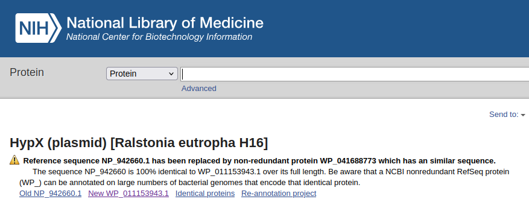
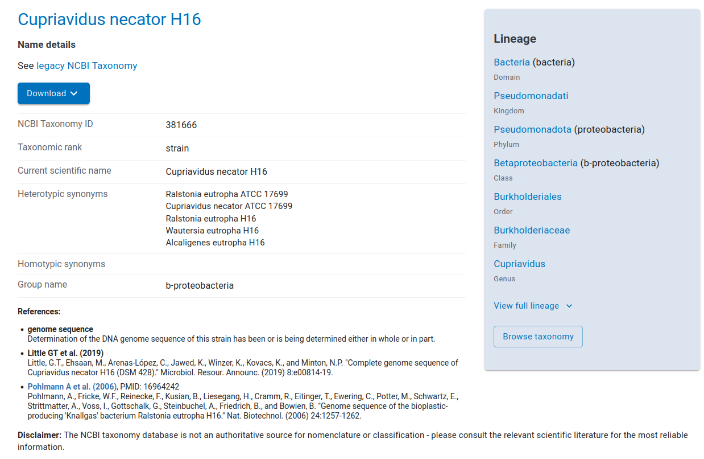
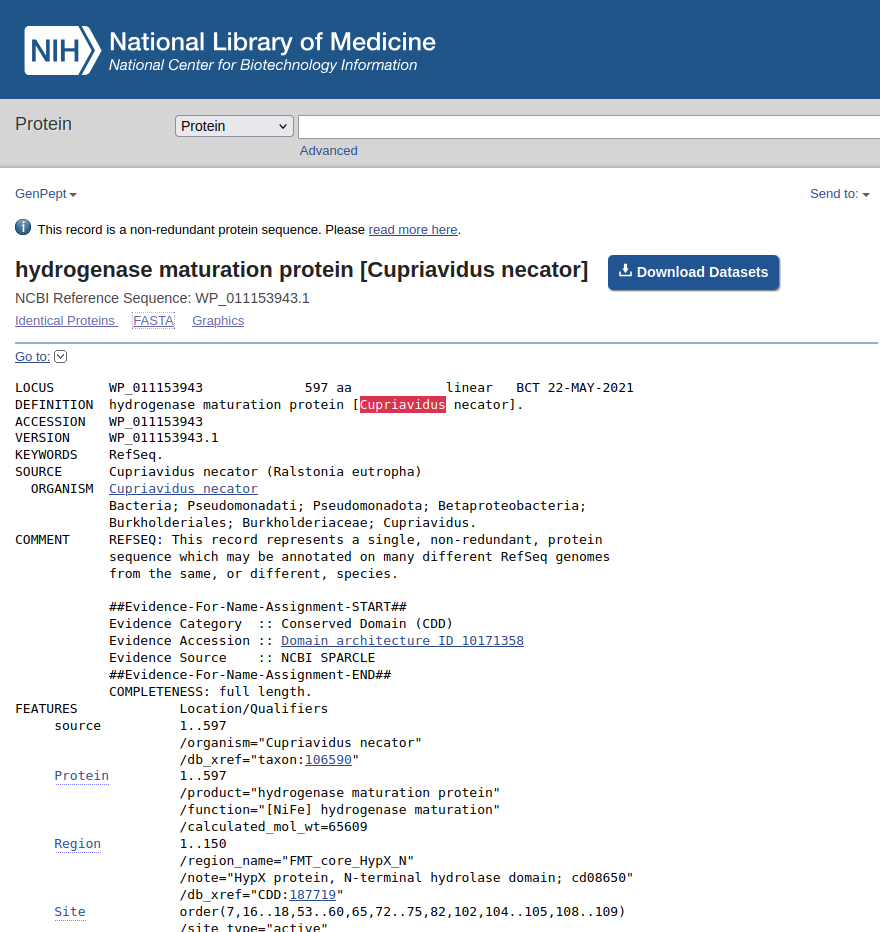
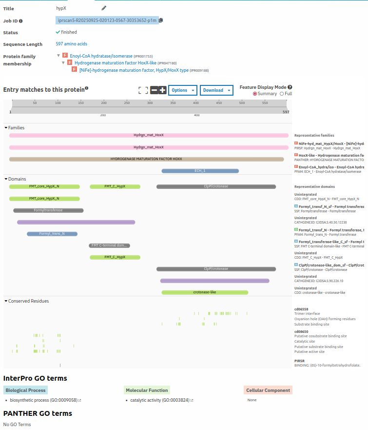
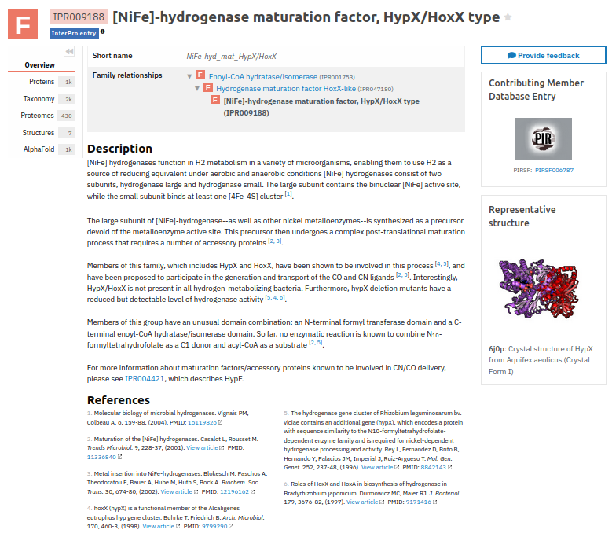

# Functional Validation of Genes

In validating gene function, we need to test whether the sequence form a product (i.e. protein or RNA) and function as its homology suggests. Functional testing often is done through several ways. Gene expression patterns using **real-time qPCR** and **RNAseq** allows initial hint on the function of gene with respect to change environmental or cultivation parameters. Additionally, analyzing **protein interactions** and **cellular localization** (such as Western Blotting and Immunoassays) can help in identifying a gene's function. 

Additionally, **gene knock-outs** or disabling genes in native host organisms also allows to show its native function through loss of function. However, *in vitro* functional analysis through **protein expression** in a model organism or overexpression *in situ* followed by conducting biochemical analysis allows as to directly examine the function. Unfortunately, both gene knockouts, and most *in vitro* functional assays are still resource intensive.

## Validation of HypX

As an example on identifying gene products with validation, I will use the gene HypX (hydrogenase pleiotropic maturation X) which helps in CO ligand formation of soluble \[NiFe\]-hydrogenases. Hydrogenases often form as basis of energy production for many lithoautotrophic organisms can cannot thrive or even survive without a functioning hydrogenase.

With  the paper of Bürstel et.al. 2016 [PMC5187695](https://pmc.ncbi.nlm.nih.gov/articles/PMC5187695/), they've provided multiple evidence on the function of HypX in the formation and maturation of \[NiFe\]-hydrogenases:
1. Measurement of HypX-deficient R. eutropha (ΔhypX)
    > - *ΔhypX* strain experience growth retardation and atributed to diminished synthesis of the mature energy-genera
2. Protein interactions
    > - The authors also showed that there is retardation in the maturation of \[NiFe\]-hydrogenase large subunits (HoxGH). 
    > - Additionally, they look into how the gene affects the pathway for CO ligand maturation. 
3. Evolutionary  relations
    > - Confirmation of its abundance to other taxa that are known of hydrogenase activity provide credence on its functional role through evolutionary history

<br>

## Finding gene sequence
Most functional papers often lay out the sequence of the genes they use for the protein expression or plasmid construction. Unfortunately, no such accession number is present in this paper. Given the paper was presented with a phylogenetic tree, the authors build the tree from HypX sequences in the NCBI database, thereby providing us the accession number for *Ralstonia eutropha* H16 HypX protein sequence [NP_942660.1](https://www.ncbi.nlm.nih.gov/protein/NP_942660.1).

Unfortunately, you might encounter a warning about this specific protein sequence if you search it through [NCBI Protein Database](https://www.ncbi.nlm.nih.gov/protein):



So, is the fasta file for *Ralstonia eutropha* H16 or *Cupriavidu necator* H16? Quick search with NCBI taxonomy can show you that these also refere to the same organism. *Cupriavidus necator* H16 has heterotypic synonyms:


<center><b><em>NCBI Taxonomy Browser</em></b></center>
<br>

From the GenPept file, you can scroll down to see the Features of the protein and also the protein themselves, such as [WP_011153943.1](https://www.ncbi.nlm.nih.gov/protein/WP_011153943.1). You can also click the **[FASTA](https://www.ncbi.nlm.nih.gov/protein/WP_011153943.1?report=fasta)** link to see it in FASTA format.


<center><b><em>NCBI Protein Features</em></b></center>
<br>

{: .note }
> Save the fasta file to your GLGY work folder as a text and fasta file. Make it standout as the reference fasta sequence.

<br>

Another way I search for proteins with validation is using, the [UniProt database](https://www.uniprot.org/uniprotkb/P07598/publications). Here is an example of my other gene *HydA* and the publications that were based on that gene. 

<br>

## Identifying your gene's protein families
Let us identify the protein family and domains that are present in your protein of choice. Running your data through [InterProScan](https://www.ebi.ac.uk/interpro/result/InterProScan/) can provide details on the family, domains and other functional details of your protein of choice. It uses various protein signature databases (e.g. Pfam, PROSITE, SMART, etc.) and leverages predictive models to provide detailed annotations of protein sequences. It helps to categorize proteins and predict structural and functional attributes.

{: .note }
> - Copy your fasta file (it accepts multi fasta format) of protein sequences and submit it to the [InterPro website](https://www.ebi.ac.uk/interpro/search/sequence/) under the tab `Search` > `[Search InterPro]` > `by sequence`
>
> - Afterwards, under `Results` you can select your job submission and select one of the fasta file you submitted.

<br>
Briefly, 

- **Protein families**

    >Protein families can identified through sequence homology, with a typical protein family exhibiting common convserved sequences to imply their evolutionary relatedness. Understanding protein families aids in predicting the behaviour of unknown proteins based on the known functions of their relatives. Databases such as Pfam, ProDom, TigrFAM and others and utilizing techniques such as **Hidden Markov Models (HMMs)** to identify probability of a sequence belonging to a certain protein family. We will tackle HMMs more later.
    >
    >One of the common example of two proteins belonging to a protein family are hemoglobin and myoglobin

- **Protein domains**

    >Meanwhile, protein domains are section or of partein that folds independently and though as evolutionary modules that can function independently. The sequences in this domains are often conserved across different organisms. A protein often can have multiple domains that serves their function. For example, my protein of choice *Ralstonia eutropha* H16 hypX belong to the "Hydrogen Maturation Factor HoxX family" and condaint atleast three putative conserve domains: a formyltransferase domain, FMT C-terminal domain, and a ClpP/crotonase-like domain:


<center><b><em>Interpro</em></b></center>
<br>

- **InterPro GO terms**

    >Aside from the families and domains, you can also find **Gene Onthology** associated terms for your proteins.
    >
    >Gene Onthology is a structure way or vocabulary use to described the gene or protein functions that is consistent in all organisms. It is mainly divided into three main categories and multiple sub-categories below them. The three main categories: **Molecular Function**, **Biological Process**, and **Cellular Component**. 

<br>

### Finding members of your protein family
From the InterPro website, we can click on the **Protein family membership** to select your protein's protein family. It should provide an overview, taxonomy, structures, pathways, and number of proteins belonging to that protein family


<center><b><em>Interpro Protein Family Overview</em></b></center>

<br>

{: .note }
> To fetch the protein sequences for this activity, I suggest to download proteins that belong to your protein family:
> 1. Click on `Overview` side tab > `Proteins` > Filter by `Reviewed`, if you have proteins more than a hundred or `All` if only few proteins are available.
> 2. Click `Download` to Generate and Download both **FASTA** and **TSV** files.
>
> {: .info }
>>The *fasta* file would be in multi fasta format and contains multiple identifiers in its headers, including its **accession** numbers. Similar accession numbers can be found in the *tsv* file to aid you in identifying the species and origin of the protein sequence

<br>

## Building a Sequence Alignment File
The multi-fasta file will use the multi-fasta file to build profiles for the protein families find other similar protein later in our class. For now, we will use it to create a multiple sequence alignment. 

Multiple sequence alignment is a bioinformatic technique used to align three or more biological sequences, such as DNA, RNA or proteins. Alignment of similar/identical nucleotides or amino acid residues  allows the identification of conserved regions that may hold functional or structural significance. It is an important step in many biological/bioinformatic analyses, such as phylogenetic tree reconstruction, protein structure prediction, and, for our purposes, functional annotation of sequences. 

Multiple algorithms and techniques are employed to do multiple sequence alignment. Common approaches often uses *progressive alignment methods* and/or *iterative refinement strategies*. **Progressive Alignment Methods** sequentially align pairs of sequences and use them to build larger sets of aligned sequences through a hierarchical approach. An example is **ClustalOmega**, which builds a guide tree on the pairwise distances between sequences to initially calculate sequence similarities. It progressively aligns sequences based on the guide tree ensuring closely related sequences are aligned first. Meanwhile, in **iterative refinement strategies** improves on alignment by repetitively adjusting and realigning subsequences based on scoring criteria. Initial alignments can be built using progressive models and then iteratively refined the alignment based on alignment scores. An example of this is **MAFFT** which can iterate local adjustments to improve consistency and accuracy. 

<br>

### Exercise 1A: Installing MSA programs

#### **Clustal Omega**
For this exercise, I suggest installing **clustalo** or **ClustalOmega** to your hardware. Easiest way to install **clustalo** is through and conda environment.

{: .activity }
> Open a **terminal** or **command prompt** and run `conda create --name clustalomega -c bioconda clustalo`.
> This will install **clustalo** as a separate conda environment.
>
> To access your `clustalo` program, activate the environment `conda activate clustalomega` and run `clustalo --help` to see if it works.
>
>{: .note }
>>Reminder if you want to exit from that environment, use `conda deactivate`

If you have trouble running **Conda**, you can download and use their precompiled binaries from the [clustal website](http://www.clustal.org/omega/). Read the `INSTALL.txt` file to understand the process of their installation.

<br>

#### **MAFFT**
Similar to **clustalo**, MAFFT can be easily installed using conda:

{: .activity }
> Open a **terminal** or **command prompt** and run `conda create --name mafft -c bioconda mafft`.
> This will install **MAFFT** as a separate conda environment.

You can also download the software based on your OS from their [website](https://mafft.cbrc.jp/alignment/software/) and follow the specific instruction per OS.

<br>

#### **MEGA**
MEGA Software or Molecular Evolutionary Genetics Analysis is a graphical-user interface (GUI) program that allows both alignment and visualization of your sequences and also other functions. For our purpose, I would not suggest aligning your sequences in MEGA as it can be slower than command-line interface (CLI) programs. 

If you want to use it, I suggest using MEGA7 or MEGA11 as other versions are finicky to work with. You can download them from [here](https://www.megasoftware.net/).

<br>

### Exercise 1B: Multiple Alignment

Let us run your selected gene/protein of choice!

Running with **clustalo** simply uses a simple call like this:

{: .activity }
>```
>clustalo -i <my-in-seqs.fa> -o <my-out-seqs.fa> -v
>```

The `-i` argument is the input while `-o` argument is the output. The `-v` argument means to make the run verbose so we can see it progress line-by-line. For more details of **clustalo** arguments, I encouraged checking the help file by `clustalo --help`.

{: .note }
> For this exercise, you have two goals:
> 1. Create a simple multiple alignment file output using *aligned fasta* format and a 
> 2. Create an output using *stockholm* format and with distance matrix output file
>
>{: .info }
>>Use the argument `--threads=<n>` to assign multiple processors to your run if you have more than 100 sequences.

<br>

### Exercise 1C: Visualizing Alignments

After aligning your sequences, let us visualize them. Open your output *fasta* file using a terminal text viewer command such as `cat` or `more` or `nano`

You can open your *stockholm* file also using the same commands.

{: .note }
> What do you notice between the two formats?

Alternatively, if you have installed MEGA, open the softwar and under `File` > > select your Alignment output. 

<br>

### Exercise 2: More alignments!

Run your protein sequences using MAFFT and see the difference. 

### Other Aligners:

| **Sequence Aligner**| **Approach**| **Notes**|
| --- | --- | --- |
| **DIALIGN-TX**          | Greedy + guide tree                        | Improved alignments (local & global); better than older DIALIGN versions.                |
| **CRASP**               | Protein functional residue detection       | Uses physicochemical properties to find co-evolving residues.                            |
| **ProbCons**            | Probabilistic consistency                  | Improves accuracy over T-Coffee, Clustal W, DIALIGN.                                     |
| **DIALIGN**             | Local segment-based alignment              | Predecessor to DIALIGN-TX; works with diagonals (gapless segments).                      |
| **Muscle (WS JABAWS)**  | MUSCLE via JABAWS                          | Command-line or Jalview integration.                                                     |
| **R-Coffee**            | RNA alignments                             | Structural info + T-Coffee variants; integrates MAFFT, MUSCLE, ProbCons.                 |
| **OPAL**                | Progressive-iterative (“Shape and Polish”) | Aligns protein & DNA; more accurate for proteins vs MUSCLE; comparable to MAFFT for DNA. |
| **UniProt align**       | Clustal Omega web interface                | Simple UniProt-hosted alignment.                                                         |
| **Phylo**               | Gamified DNA MSA refinement                | Easy to use, no expertise required.                                                      |
| **PRANK**               | Phylogeny-aware alignment                  | Models insertions/deletions with evolutionary context.                                   |
| **OD-seq**              | Outlier detection                          | Flags inconsistent sequences in MSA.                                                     |
| **BARCOD**              | Indel coding                               | Converts indel events into character matrix.                                             |
| **MAFCO**               | File compression                           | Compresses multiple alignment format (MAF) files.                                        |
| **HmmCleaner**          | Error filtering                            | Removes misaligned regions using HMM profiles.                                           |
| **MSA-PAD 2.0**         | Web DNA alignment                          | Uses PFAM or user profiles; login required.                                              |
| **PnpProbs**            | Hybrid approach                            | Non-progressive for distant sequences, guide tree for close ones.                        |
| **ANTICALIgN**          | Protein engineering                        | Reference-template based combinatorial MSA.                                              |
| **FAMSA**               | Fast, large families                       | Scales to huge protein families; slightly less accurate than MAFFT.                      |
| **MSAprobs**            | HMM + probabilistic                        | Accurate protein sequence alignment.                                                     |
| **T-Coffee (EBI)**      | Consistency-based                          | Integrates many alignment sources; handles DNA & proteins.                               |
| **Biojs-io-clustal**    | Browser parser                             | Parses Clustal files in web applications.                                                |
| **PASTA**               | Guide tree-based                           | “Practical Alignment using SATé and Transitivity.”                                       |
| **SARA-Coffee**         | Structure-driven RNA alignments            | Combines pairwise 3D RNA structural alignments.                                          |
| **Staccato**            | Structure + sequence probabilities         | Blends 3D structure probabilities with amino acid replacement models.                    |
| **MARS**                | Circular genomes                           | For mitochondrial and viral genomes.                                                     |
| **Multi-LAGAN**         | Multi-genomic alignment                    | Also called MLAGAN; for large genomes.                                                   |
| **Pro-Coffee**          | Promoter regions                           | T-Coffee module specialized for promoters.                                               |
| **R3D-2-MSA**           | RNA 3D + sequence                          | Links RNA 3D structures with sequence alignments.                                        |
| **ProDA**               | Local MSAs                                 | Detects homologous regions first.                                                        |
| **MSAProbs-MPI**        | Parallel MSAprobs                          | MPI implementation for faster runs.                                                      |

<br>

<br>

# Tips and Summary
Basic Unix-like environment terms and commands in terminal


|**Terminologies**|**Definitions**|
|---|---|
|`path`|address of files and folder within the computer|
|CWD/PWD| the current or present working directory is the location of the terminal within the computer hierarchy. This is where you currently are.|
|`root`|is the top-level directory in a computer partition|
||root directory is represented as `C:\` or `D:\` in windows and `\` in Linux or macOS|
| `~` |the user's home folder is where the personal files of the user is located. It is often the first location when booting a terminal.|
||It can be represented as `~/` but is often located in `/home/<username>/`|
|absolute path|the address of file and folder from the specified 'root' or 'home' location|
|relative path|the path of files and folders based on your CWD|
|`./`|In relative path, this indicate the CWD|
|`../`|In relative path, this indicate the folder above the CWD|
|`-`|When running the `cd` command, `-` represents the previous working directory|

|**Commands**|**Definitions**|
|---|---|
|`ls`|The **list** command shows the files and folder inside the supplied *ARGUMENT* |
|`head`|The **head** command shows the top lines within the  *ARGUMENT* supplied text file|
|`tail`|The opposite of **head**. The tail shows the bottom lines|
|`more`|Displays a text file within the terminal|
|`less`|Displays a text file in the terminal on a separate screen instance|
|`pwd`|a command to show the current or present working directory|
|`cd`|The **change directory** command moves the current working directory|
|`mv`|The **move** command moves files and folders from the `<orginal filepath>` to the `<destination filepath>`|
|`cp`|The **copy** command creates a copy of files from the `<orginal filepath>` to the `<destination filepath>`|
|`mkdir`|creates a new directory|
|`rm`|The **remove** command deletes a file or folder|
||⚠️ **Warning**: There is no trash bin in the terminal or linux. Deleted files are deleted permanently|
|`nano`|A text-editor. Create a file by running `nano <filename>`|
|`vim`|Another text-editor similar to previous one|
|`--help`|is a *flag* that aids in identifying all the arguments of most of the command displayed above|


# Acknowledgement
This tutorial uses screenshots from NCBI and EBI/InterProScan websites. Any grievances, please let me know.r

# Citation
[1] Lee, (2019). Happy Belly Bioinformatics: an open-source resource dedicated to helping biologists utilize bioinformatics. Journal of Open Source Education, 4(41), 53, https://doi.org/10.21105/jose.00053

