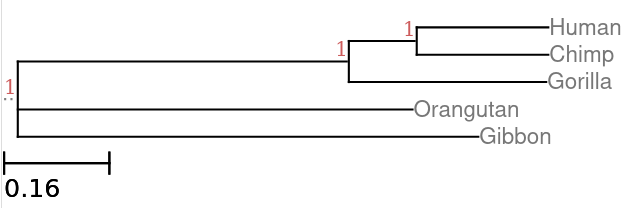
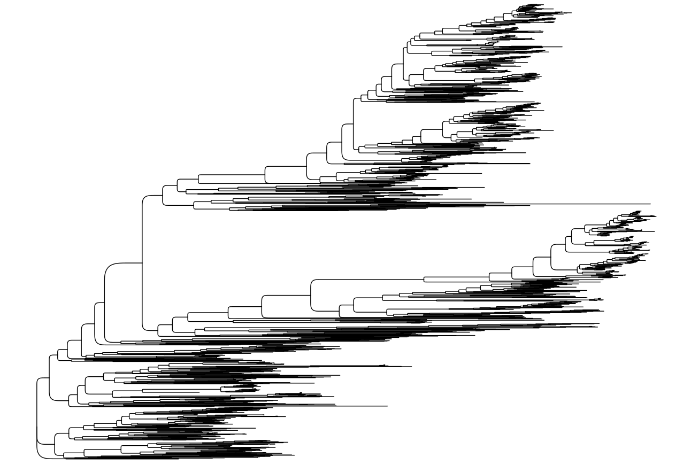
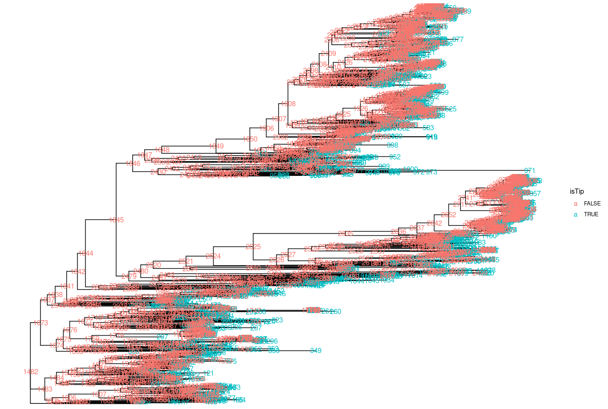
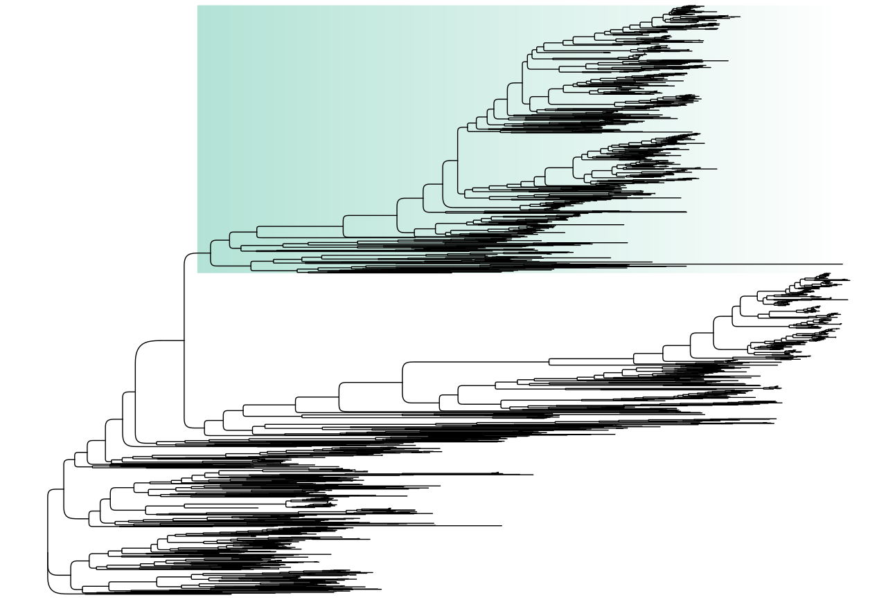
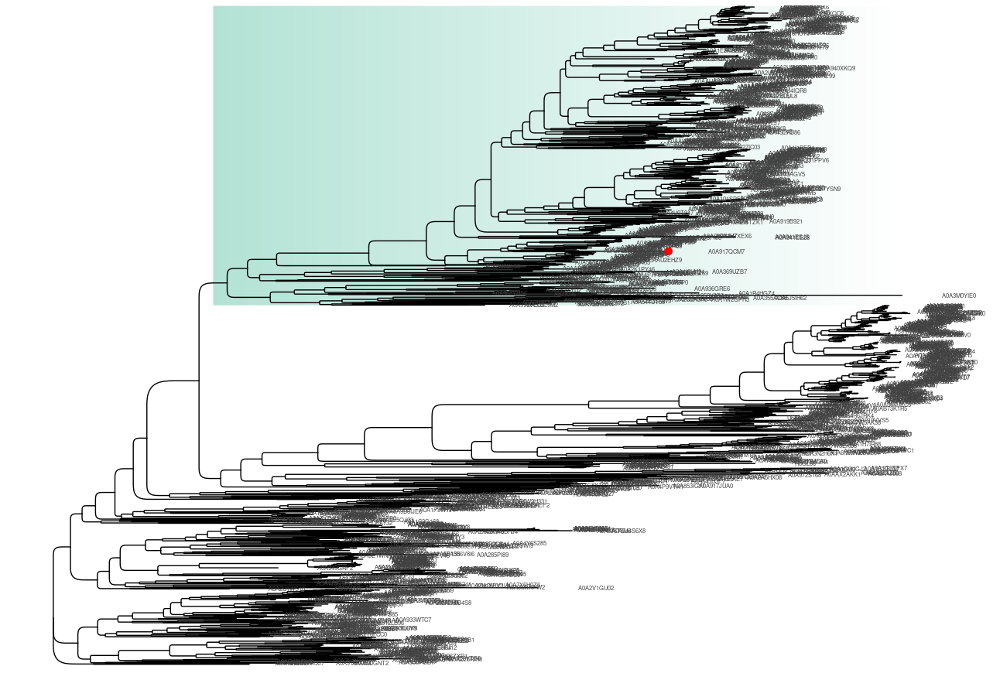

# What are Phylogenetic Trees
Phylogenetic trees serve as vital tools in biology, providing a structured visual representation of the evolutionary relationships among various biological entities, including species, genes, and viruses. These trees are grounded in the principles of common ancestry and depict how different organisms or genes have diverged from shared ancestors over time (Bordewich et al., 2017; Gregory, 2008). They are constructed using various forms of data, primarily genetic sequences such as DNA, RNA, or protein alignments, which allows for detailed comparative analyses.

Given that phylogenetic trees shows evolutionary relations, aligning DNA, RNA and/or protein sequences is a must step to properly score for any changes in the sequence, may it be substitution, deletion, insertion and/or duplication. Alignment is a crucial step in building trees as errors can skew evolutionary interpretation.

<br>

## Goals
In this section, we have several goals:
1. Build a phylogenetic tree using MSA fasta file
2. Visualize a phylogenetic tree
3. Cluster proteins to build a Tree

This section requires several programs:
1. FastTree v2.2
2. R and R Packages: Tidyverse, TreeIO and GGTree 

<br>

# Building a Tree
Different methodologies for phylogenetic tree construction can be categorized broadly into distance-based, parsimony-based, and likelihood-based approaches. **Distance-based methods**, such as the Neighbor-Joining algorithm, are favored for their simplicity and computational efficiency, especially when dealing with large datasets (Qin et al., 2006). In contrast, **Maximum Likelihood** and **Bayesian inference** methods offer more robust frameworks for considering complex evolutionary models but often require more computational resources (Cerutti et al., 2011; Scott & Gras, 2012). The choice of method can significantly influence the topology and branch lengths of the resultant tree (Liu et al., 2009).


## Measuring Distances and Scoring Tree
**Distance-based** methods measure pairwise distances/differences between sequences to build tree. Meanwhile, **character-based** methods look directly at the characters in the aligned sequences and attribtue a score on the changes or evoloved as depicted in the sequences (i.e. substitution or evolutionary models) to take into account *rate heterogeneity* and *base/amino acid* frequency variations.

{: .note }
> For a simple demonstration of distance based method, please take a look at [Lesson 2A: Neighbor-joining](./Lesson2-2.md)

There are multiple ways in *character-based* methods to build a phylogenetic tree. In **Maximum Parsimony**, it operates on the principle that the *best tree is the one that requires the fewest evolutionary changes across all sites*. It assumes that each character or column in an sequence alignment is independent of each other. It is intuitive and fast and does not need complex evolutionary models but fails when there are fast-evolving sequences as it cannot easily differentiate them and interaction between segments of the sequences.

In contrast, **Maximum Likelihood** methods (ML) takes into accoutn evolutionary models. It tries to find *the best tree or topology of sequences by finding the tree that best explained an evolutionary model*. In ML tree building, it creates multiple trees to match a given topology and branch length to match an evolutionary model and assigns a score for each. The tree with highest score is chosen. It is very rigorous but often are time and computationally consuming. 

>**Bootstrapping** is the resampling from the same input several times to check on the uncertainty of your model or trees. 
>It is used to measure the reliability of clades that were formed after repeated resampling or subsampling of sequences. A clade that occurs 990/1000 times is more certain to occur than a clade that only appears 130/1000 times that a tree was formed

Lastly, similar to ML, **Bayesian Inference** it assignes probability that the tree or topoplogy is correct based on an evolutionary model. However, rather than finding the "best" tree, it estimates the posterior probability distribution of tree/topology. 

> **Posterior probabilities** are conditional probabilities derived from Bayes’ rule. They combine prior knowledge with observational data under a chosen model, reflecting our updated belief about a hypothesis or parameter. Importantly, each posterior can serve as a new prior for further Bayesian updating when new information arrives.
> In *Bayesian inference* made trees, posterior probabilities are used to determine clade worthiness rather than bootstrapping percentage.

<br>

### Exercise 2A: Building a tree

Here, we will use the multiple sequence alignments created from previous exercise. We will use the fasta formatted MSA files as input for Tree Building. 

{: .note }
> Build a tree using your MSA files
> 1. Run Fast Tree using the default settings:
> ```
> FastTree <protein_alignment>.msa.fasta > <protein_alignment>.fast.tree
> ```
>
> 2. Check your outputs by using `more` or `less` or `nano`

In addition, let us create a tree with a different evolutionary model. By default, FastTree uses ML and Jones-Taylor-Thorton model for tree-building using amino acids. Another evolutionary model is Le-Gascuel (LG).

{:.note }
> Build a tree using LG model:
> ```
> FastTree <protein_alignment>.msa.fasta > <protein_alignment>.lg.tree
> ```
> Note: that here I change the file extension of the file to denote different trees.

<br>

## Tree visualization and interpretation 
### Newick Format
If you open the `*.tree` files [here](./sequences/hypx_interpro-IPR009188.msa.default.tree), you can see it is written in newick format. The newick format stores the topology of the tree based on the series of parenthesis, the name of the tips (i.e. Gorilla), and the distance from its common node.

Here is an example:
```
(((Human:0.2,Chimp:0.2):0.1,Gorilla:0.3):0.5,Orangutan:0.6,Gibbon:0.7);
```

This can be interpreted as such:
- **`Human:0.2`** → leaf **Human** with branch length `0.2`  
- **`Chimp:0.2`** → leaf **Chimp** with branch length `0.2`  
- **`(Human:0.2,Chimp:0.2):0.1`** → Human and Chimp grouped together, clade branch length `0.1`  
- **`Gorilla:0.3`** → leaf **Gorilla** with branch length `0.3`  
- **`((Human:0.2,Chimp:0.2):0.1,Gorilla:0.3):0.5`** → Human, Chimp, and Gorilla grouped together, clade branch length `0.5`  
- **`Orangutan:0.6`** → leaf **Orangutan** with branch length `0.6`  
- **`Gibbon:0.7`** → leaf **Gibbon** with branch length `0.7`  
- Wrapping all clades → **`(((Human,Chimp),Gorilla),Orangutan,Gibbon);`**

Of course it is hard to understand when written such as this. We can use newick formats to visualize a tree. Here is the visualization of the abovementioned tree:



<br>

### GGTree: an Elegant Graphics for Phylogenetic Tree Visualization

There are multiple ways to visualizing a phylogenetic tree. One is  through the program `MEGA11` which we installed previously and another is through the R Package `GGTree` which will be using through `R` or its IDE `RStudio`. 

`GGTree` has robust way of modifying a tree (Yu, 2020). For more details please visit their [github site](https://guangchuangyu.github.io/ggtree-book/chapter-treeio.html). The package can visualize in multiple formats, such as slanted, circular, radial and others:


[Photo taken from: https://guangchuangyu.github.io/ggtree-book/chapter-ggtree.html](https://guangchuangyu.github.io/ggtree-book/chapter-ggtree.html)

Additionally, you can add annotations and combined them with the tree in `GGTree`. Here is an example:

[Photo taken from: https://guangchuangyu.github.io/ggtree-book/chapter-ggtree.html](https://guangchuangyu.github.io/ggtree-book/chapter-ggtree.html)

Here is another example:

[Photo taken from https://guangchuangyu.github.io/ggtree-book/chapter-ggtree.html#discussion-1](https://guangchuangyu.github.io/ggtree-book/chapter-ggtree.html#discussion-1)

### Exercise 2B: Tree visualization

Let us visualize our trees! First step is loading it up to your `R`. 

Create an Rscript or RMarkdown and clean our input:

{: .note}
>1. Load your libraries (Make sure they are installed prior)
>```
>library(tidyverse)
>library(treeio)
>library(ggtree)
>```
>2. Read your tree
>```
>tree_orig <-read.tree("./path/to/your/fast.default.tree")
>```
>3. Visualize all the tip labels:
>```
>tree_orig$tip
>```

As you can see, most of the tip labels is using their accession number and other details. We will remove the other details and leave them with just accession number for now.

{: .note }
>4. Retain Accession number only for tip labels
>```
>tree_orig$tip.label <- str_replace_all(tree_orig$tip.label, "\\|.*\\|.*", "")
>tree_orig$tip.label
>```
>
>5. If you type `tree_orig`, you will see all the properties of your object as such:
>```
>Phylogenetic tree with 1481 tips and 1468 internal nodes.
>
>Tip labels:
>  A0A933JFM2, A0A934L9U7, Q44027, Q79IP8, A0A7Y0DMC1, A0A2T6FCC0, ...
>Node labels:
>  , 0.977, 0.961, 0.647, 1.000, 0.727, ...
>
>Unrooted; includes branch length(s).
>```

Now, that we properly cleaned our input, we can visualize it using ggtree.

{: .note }
>1. Create a ggtree object and visualize it:
>```
>plot_tree <-ggtree(tree_orig, layout = 'roundrect')
>```
>This should show a bare tree if your run `plot_tree`.
>
>2. Let us add details:
>```
>plot_tree <- ggtree(tree_orig, layout = 'roundrect') +
>    geom_tiplab(offset=0.05) +
>    geom_nodepoint(size =1, color = blue) +
>    geom_tippoint(size = 1)
>```
>Here I colored the nodes and the tips, but as you can see, it can be messy.

This is the basic of GGTree. You can modify them further by checking up [GGTree guide](https://github.com/YuLab-SMU/ggtree).

<br>

### Annotating a Tree

Before we end, here I will give an example of a tree with annotation. Here is a bare tree:
```
plot_a <-ggtree(tree_orig, layout = 'roundrect') 
```


To annotate a leaf of the tree, we must first know the node and tip numbers.
```
#Identify Node Labels
plot_nodes <-ggtree(tree_orig)+geom_text(aes(label=node, color = isTip), offset=0.05, size = 4)
```


With the node we want to annotate known (i.e. `1846` for me), we can highlight the whole clade it belongs.
```
plot_a <-ggtree(tree_orig, layout = 'roundrect') 
plot_b <-plot_a +
  geom_hilight(node=1846, fill='#009E73', 
               type = "gradient", 
               gradient.direction="rt", 
               alpha=0.3, to.bottom = TRUE) 
```


Lastly, we add the tip labels and highlight the protein sequence of interest by labeling its tips.
```
plot_a <-ggtree(tree_orig, layout = 'roundrect') 
plot_b <-plot_a +
  geom_hilight(node=1846, fill='#009E73', 
               type = "gradient", 
               gradient.direction="rt", 
               alpha=0.3, to.bottom = TRUE) 
plot_c <- plot_b +
  geom_tiplab(offset=0.1, size = 2, color='grey25') +
  geom_point2(aes(subset= (label == "A0A917QCM7")),
              color = 'red', size=3)
```


# **TO DO:**
1. Cluster your >10,000 protein sequences using `mmseqs`. For more details: [Lesson 2B is here](./Lesson2-3.md).
    - You might need to re-align the sequences
2. Create a radially formatted tree
3. Highlight the clade where your annotated protein sequence is.
    - Are you sure that your protein fasta is in your MSA file?

# Tree Visualization Softwares

| Tool | Type | Description |
| -- | -- | -- |
| **GGTree** | R Package | [GGTRee Paper](https://currentprotocols.onlinelibrary.wiley.com/doi/10.1002/cpbi.96) |
| | | [GGTree Guide](https://yulab-smu.top/treedata-book/chapter1.html). Unfortunately, the firewall prevents this to be opened within University of Calgary network. Please view this documentation using outside networks. |
| | | [GGTree Examples](https://github.com/GuangchuangYu/ggtree-current-protocols) |
| **iTOL** | Web based | The interactive tree of life has a visualization and annotation in their [website](https://itol.embl.de/). |
| | | Their [help pages](https://itol.embl.de/help.cgi) is useful tool. Please take your time on it. |
| ETE Toolkit | Python Module | If you are more inclined to use python and its module, [ETE Toolkit](https://etetoolkit.org/) would be very useful|
| | | They have a detailed guide [here](https://etetoolkit.org/docs/latest/tutorial/tutorial_drawing.html). |
| MEGA 11 | GUI Desktop Program | The [MEGA software](https://www.megasoftware.net/) can also visualize newick formatted trees. It also allow topology annotation through its **TREE Topology Editor**. |
| TVBOT | Web based | It many tree layouts and flexibility. It can add annotations too. It also has video tutorials and guide. Please check: https://www.chiplot.online/tvbot.html |
| | | Publication: https://doi.org/10.1093/nar/gkad359 |


# Acknowledgement
This tutorial uses screenshots from GGTree and iTOL wikis/websites. Any grievances, please let me know.

# Citation
[1]Bordewich, M., Deutschmann, I., Fischer, M., Kasbohm, E., Semple, C., & Steel, M. (2017). On the information content of discrete phylogenetic characters. Journal of Mathematical Biology, 77(3), 527-544. https://doi.org/10.1007/s00285-017-1198-2

[2]Gregory, T. (2008). Understanding evolutionary trees. Evolution Education and Outreach, 1(2), 121-137. https://doi.org/10.1007/s12052-008-0035-x

[3]McMahon, M., Deepak, A., Fernández‐Baca, D., Boss, D., & Sanderson, M. (2015). Stbase: one million species trees for comparative biology. Plos One, 10(2), e0117987. https://doi.org/10.1371/journal.pone.0117987

[4]Cerutti, F., Bertolotti, L., Goldberg, T., & Giacobini, M. (2011). Taxon ordering in phylogenetic trees: a workbench test. BMC Bioinformatics, 12(1). https://doi.org/10.1186/1471-2105-12-58
Chan, C. and Ragan, M. (2013). Next-generation phylogenomics. Biology Direct, 8(1). https://doi.org/10.1186/1745-6150-8-3

[5]Liu, S., Ji, K., Chen, J., Tai, D., Jiang, W., Hou, G., … & Huang, B. (2009). Panorama phylogenetic diversity and distribution of type a influenza virus. Plos One, 4(3), e5022. https://doi.org/10.1371/journal.pone.0005022

[6]Qin, L., Luo, J., Chen, Z., Guo, J., Chen, L., & Pan, Y. (2006). Phelogenetic tree construction using self adaptive ant colony algorithm.. https://doi.org/10.1109/imsccs.2006.104

[7]Scott, R. and Gras, R. (2012). Comparing distance-based phylogenetic tree construction methods using an individual-based ecosystem simulation, ecosim.. https://doi.org/10.7551/978-0-262-31050-5-ch015

[8]Yu, G (2020). Using ggtree to visualize data on tree-like structures. Current Protocols in Bioinformatics, 69:e96. https://doi.org/10.1002/cpbi.96