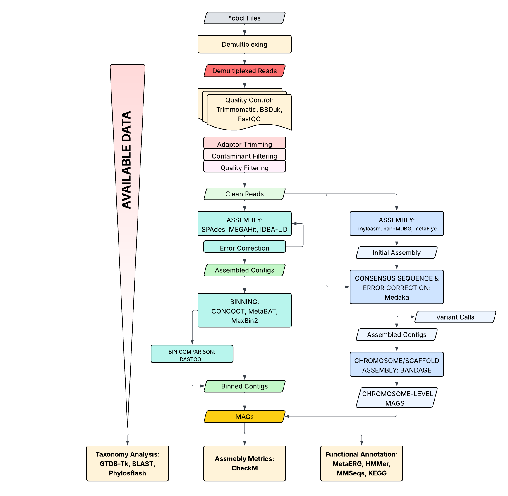
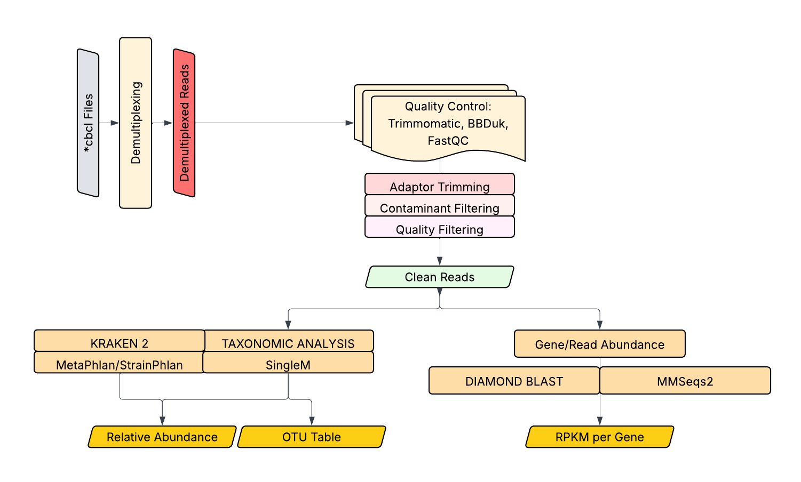

# Metagenome Sequencing and Bioinformatic analysis
Metagenome sequencing is a powerful technique used to study the collective **genetic material of all organisms** (viruses, fungi, bacteria, archaea, and microscopic eukaryotic cells) present in an environmental sample, such as soil, water, or the human gut. It allows the elucidation of diversity and composition of these environment without the need to culture them. By sequencing all DNA directly, researchers can identify microbial species, genes, and metabolic pathways, offering insights into community composition, diversity, and functional potential. This approach enables the discovery of novel organisms, enzymes, and ecological interactions, making it a cornerstone of modern microbial ecology and environmental genomics.

Metagenome sequencing results in the creation of **big data** which can be troublesome to manually and individually analysed. Various bioinformatic tools have been developed to enhance the efficiency of metagenomic analysis, enabling rapid identification of strains and their associated functions. Multiple ways can be done to tackle the data produced by metagenomic sequencing, both through assembly-based and read-based analysis. This workflows varies depending on the purpose of your analysis.

In this lesson, we will discuss metagenome sequencing and the bioinformatic workflows we can use to deal with our data.

 

## Sequencing: Short Reads vs Long Reads

Next generation sequencing can be divided into two main categories: *short* and *long reads* sequencing. Short reads are sequencing of DNA with length **100-500 nucleotides (nt)** and among the earliest version of high-throughput sequencing platforms (Roche Pyrosequencing, Illumina/Solexa's Sequencing-by-synthesis Technology, ThermoFisher's IonTorrent systems). Meanwhile, long read sequencing are among the newest innovation next generation sequencing platform able to sequence reads as long as **10,000 to 1 million nt**. Among these are Pacific Biosciences' SMRT Sequencing for real-time sequencing and Oxford Nanopore Technology's portable nanopore sequencing.

 

### Sequencing biases and errors

Errors and sequencing biases often arises due to the limitations and preferences of the sequencing chemistry used by specific sequencing platforms or the workflow used to prepare **DNA/RNA Libraries**. Some of the sequencing errors and biases can be seen here:

| Sequencing Technology| Common Errors/Biases| Relevant References|
|---|---|---|
| Illumina                      | High substitution error rates in GC rich regions;   Motif biases affecting accuracy;   Short read lengths that complicate assembly | Clemente et al., 2011; Schirmer et al., 2015 |
| 454 Pyrosequencing            | Mainly suffers from indels in **homopolymer regions** | Yang et al., 2010;Gomez‐Alvarez et al., 2009|
| Ion Torrent                   | Errors also due to indels in homopolymer regions;   Incorrectly over/under-calling number of bases | Yang et al. 2010|
| PacBio                        | High error rates (~11%) primarily as indels;   issues with coverage and assembly of complex communities due to erroneous reads |Frank et al., 2016|
| 16S rRNA Gene Sequencing      | PCR amplification biases and chimeras can skew results and biases on rare taxa detection;   Reduce community resolution due to limited gene length when using short reads | Shah et al., 2010; Martijn et al., 2017|
| Nanopore Sequencing           | Variable error rates;    May require higher sequencing coverage to achieve accuracy| Brown et al., 2017|

 

There are trade-offs using different sequencing platforms. Here are some of the comparison between the limitations of the two sequencing platforms:

| **Limitation**                       | **Short-Read Sequencing**                      | **Long-Read Sequencing**                        |
|--------------------------------------|------------------------------------------------|------------------------------------------------|
| **Read Length**                      | Limited read lengths (typically 50-300 bp)    | Longer read lengths (up to 30 kb or more)     |
| **Assembly Complexity**              | Greater difficulty in assembling complex genomes due to repetitive regions (Schatz et al., 2010) | Better for resolving repetitive regions, but sometimes challenging in accuracy (Chin et al., 2016) |
| **Error Rates**                      | Generally lower error rates (0.1-1%)           | Higher error rates (10-15%) for some platforms (Rhoads and Au, 2015) |
| **Cost per Base**                    | Lower cost per base, suitable for large sample sizes (Goodwin et al., 2016) | Higher cost per base, making large-scale projects expensive |
| **Data Volume**                      | Produces vast amounts of data that can be cumbersome to analyze (Mardis, 2008) | Generates less data volume, which can ease data management but may miss genomic information |
| **Structural Variant Detection**     | Challenges in detecting large structural variants (Alkan et al., 2011) | Superior in detecting large structural variants and complex rearrangements (Moberly et al., 2019) |
| **Homopolymer Resolution**           | Poor resolution in homopolymeric regions (Davies et al., 2016) | Better resolution of homopolymers with longer reads |
| **Nuances in Variant Calling**       | Less effective at capturing variants in highly heterogeneous regions (Meyer et al., 2017) | More nuanced variant calling capabilities due to longer context |
| **Gene Isoform Detection**           | Limited ability to detect alternative splicing and isoform diversity (Wang et al., 2009) | Improved ability to detect and characterize different isoforms (Sullivan et al., 2019) |
| **Sample Type Compatibility**        | Works well with high-quality DNA samples       | May struggle with degraded or low-quality samples, though some technologies are improving |

 

## Sequencing: Library Preparation

After selecting a sequencing platform based on the errors and biases presented above, there are other consideration you need to check when you prepare for your sequencing run. PCR enriched or PCR-free libraries, GC content biases, input quality and quantity are among them. 

Here are some important aspects to keep in mind during library preparation:
- **Input DNA Quantity and Quality**: *The amount and integrity of starting DNA significantly affect library quality*. 
    >High-quality and sufficient quantities of DNA are essential for effective library generation. Some protocols, such as those using the Nextera XT DNA Library preparation kit, require 1-4 µg of starting DNA, which may not be feasible for low-input samples (Pasquali et al., 2019; Gao et al., 2022). Newe libraries such as NEBNext Ultra II Kit can go as lows as 100pg of DNA input.

- **Fragmentation Method**: *The choice of fragmentation technique (e.g., mechanical, enzymatic, or tagmentation) influences insert size and library complexity*. 
    >Tagmentation tends to produce shorter fragments compared to other methods, which can be a limitation for certain applications (Vonesch et al., 2020). Additionally, newer methods utilizing engineered transposases enable rapid preparation with lower input requirements (Picelli et al., 2014).

- **PCR Amplification**: *PCR steps during library preparation can introduce bias affecting downstream analysis*. 
    >Enrichment PCR may lead to GC bias and impact the representation of certain sequences Kia et al., 2017). It is crucial to monitor and optimize the number of cycles to mitigate these biases.

- **Size Selection**: *The size distribution of fragments can influence sequencing performance*. 
    >Minor deviations can impact the representation of larger or smaller fragments. Size selection techniques must be carefully evaluated and standardized to maintain the integrity of the samples, especially in metagenomic contexts (Lan et al., 2015; Vardi et al., 2017).

- **Purification Methods**: *Purification methods (solid phase reversible immobilization, size selection chromatography, enzymatic cleanup) can yield different input quality.*
    >Effective purification during library preparation is vital for removing unwanted nucleotides and enzymes, as well as for enriching the desired fragment sizes. Innovative purification methods can improve recovery efficiency, particularly for degraded samples (Sato et al., 2019; Puchta et al., 2025).

- **Sample Indexing**: *Incorporating sample barcoding facilitates multiplexing and improves throughput*. 
    >Non-uniform performance between barcodes can introduce bias if not properly managed (Hahn et al., 2021). Therefore, emphasis is placed on developing protocols that support uniform amplification across indexed samples.

- **Customization of Protocols**: 
    >Tailoring library preparation methods to accommodate the specific needs of DNA types (e.g., ancient, degraded, or low-input DNA) is essential for improving efficiency (Adey et al., 2010; Carøe et al., 2017). Adapting protocols based on specific research applications, such as RNA sequencing or genomic studies, is also important.

 

# Bioinformatic Analysis: Short Read and Long Read Pipelines
Differences between short and long read sequencing also affect differenct in bioinformatic workflows for sequence analysis. The properties, biases, and errors of the sequencing platform should be reflected during bioinformatic analyses. For both short and long reads, processing of raw data often follow the same path. Raw basecall file (*.bcl for Illumina, *.pod5 for nanopore, OBC for pacbio) can be demultiplexed, if indexed, to separate libraries and followed by quality control. Quality control removes adaptor, contaminants and check whether reads has good enough quality and length for downstream analysis. The cleaned reads generated from this can be used for both read-based and assembly-based analysis.

 

## Assembly-based workflow

In assembly-based workflows, processing of long- and short-reads slightly differs due to difference in the intrinsic properties of the reads. Short read assemblers often need to be binned as they form at most few discontiguous sequences. Chromosome/scaffold level assembly is often unlikely due to highly repetitive regions hindering their formation. Meanwhile, long-read assemblers often can form scaffold level assembly of due to their longer read-length but due to higher error rates in long read sequencing, assemblies often requires deeper error correction steps to minimize their effect. 

Assembled metagenome-assembled genomes (MAGs) can be used similar to most downstream genomic analysis such as taxonomic analysis, functional annotation and others. However, some caveat should be considered as MAGs are known as potential amalgamation of different strains and can be difficult to be used directly at strain-level analysis or single nucleotide variant (SNV) analysis.

Additionally, it is worth to point out that data complexity as you proceed from cleaning to assembly to binning decreases. However, this loss is often accomapnied by loss on data also brought by lack of read depth for assembly or binning. Therefore, read-based analysis often are employed to circumvent this loss of data.

 

### Assembly Methods
Various computational methods have been developed to tackle the complexities of assembling metagenomic data, chiefly relying on two prominent approaches: the De Bruijn Graph (DBG) and the Overlap Layout Consensus (OLC) methods. Each of these methodologies has unique strengths and weaknesses that influence their effectiveness depending on the metagenomic assembly context.

The De Bruijn Graph approach fragments the DNA sequences into k-mers (substrings of length k) to create an efficient representation of overlapping sequences. This method is well-regarded for its memory efficiency and speed in handling large datasets. Algorithms such as metaSPAdes utilize DBG to construct assembly graphs, enabling the reconstruction of genomic paths that correspond to distinct microbial genomes within the metagenomic dataset (Nurk et al., 2017). However, the sensitivity of DBG’s assembly is greatly impacted by polymorphisms within the data, which can lead to inaccuracies if not properly managed (Lin et al., 2017).

In contrast, the Overlap Layout Consensus (OLC) method primarily focuses on aligning sequences based on overlaps and then builds a consensus sequence from the aligned data. This approach is particularly beneficial for assembling long, error-prone reads, as it can account for repeat sequences more effectively than DBG methods (Kolmogorov et al., 2019). Recent advancements have led to hybrid methods that combine both DBG and OLC methodologies (Lin et al., 2016). These hybrid strategies, such as ABruijn, aim to leverage the strengths of both approaches to improve assembly accuracy and efficiency (Kolmogorov et al., 2018).

| **Method**                  | **Description**                                                                 | **Use Cases**                          | **Strengths**                               | **Limitations**                       |
|-----------------------------|---------------------------------------------------------------------------------|---------------------------------------|---------------------------------------------|-------------------------------------|
| **De Bruijn Graph (DBG)**   | Constructs a graph from k-mers derived from sequences.                        | Short-read metagenomics               | Efficient for large datasets, memory-effective | Sensitive to polymorphisms            |
| **Overlap Layout Consensus** | Aligns sequences based on overlaps and generates a consensus sequence.      | Long-read metagenomics                | Effective for repeat regions and long reads | Computationally intensive             |
| **Hybrid Methods**          | Combines DBG and OLC to enhance assembly accuracy.                             | Complex metagenomic datasets          | Leverages strengths of both approaches     | Potentially complex implementation   |

## Read-based workflow
Read-based workflow directly work on the processed cleaned reads. Most read-based analysis that have been developed is based on short-reads as it was the most  dominant for the past few years. However, newer algorithms are used for the analysis of longer reads. Long reads have also the advantages for direct gene prediction based on their size. 

For taxonomic analyis, common methods are KRAKEN2, MetaPhlan and singleM among others. Kraken2 and MetaPhlan uses read mapping to determine the identity of reads to whole genome or MAG databases. In contrast, singleM aligns using DIAMOND BLAST reads agains marker gene hidden markov models (HMMs)

# Bionformatic Programs
Here are some common software for metagenomic analysis:
1. **Demultiplexing**

    - **bcl2fastq**: A widely used tool that converts binary sequencing files (BCL format) from Illumina sequencing runs into demultiplexed FASTQ files, facilitating downstream analysis.

2. **Quality Filtering and Control**

    - **FastQC**: A tool designed for providing a visual overview of sequence quality, enabling users to identify potential issues with the data before analysis.
    - **Trimmomatic**: A flexible read trimming tool that allows for aggressive filtering of low-quality sequences and removal of adapter sequences from FASTQ files.
    - **Cutadapt**: A package for removing adapter sequences from high-throughput sequencing reads, thereby improving the quality of the dataset for downstream analysis.
    - **PRINSEQ**: A tool for filtering and trimming sequences based on user-defined quality thresholds, providing a straightforward way to preprocess sequencing data.
    - **Guppy**: A base calling software developed by Oxford Nanopore Technologies for processing raw signal data from nanopore sequencers, ensuring high-quality sequence outputs Cuscó et al. (2021).
    - **Canu**: A tool that corrects raw long reads and generates high-quality long-read assemblies, particularly useful for error correction in nanopore and PacBio data (Koren et al., 2017).

3. **Quality Visualization**

    - **FastQC**: (Also mentioned in filtering and control) This tool exhibits quality score distributions, GC content, and other quality metrics in a user-friendly graphical format, essential for assessing dataset integrity.

4. **Assembly**

    - **MEGAHIT**: A fast assembler for large and complex metagenomic datasets, optimized for speed and memory efficiency while maintaining high assembly quality.
    - **metaSPAdes**: A versatile metagenomic assembler that extends the capabilities of SPAdes to handle metagenome-specific complexity, producing high-quality assemblies even from noise-rich datasets
    - **IDBA-UD**: An assembler that utilizes de Bruijn graphs to more effectively handle the assembly of diverse microbial communities, often yielding accurate genomic reconstructions.
    - **MetaVelvet**: An extension of the Velvet assembler specifically designed for de novo metagenome assembly from short read sequencing data, optimizing its performance for complex datasets 
    - **metaFLye**: An assembler specifically designed for long-read metagenomic sequencing, allowing assembly of high-quality metagenomes from complex datasets 
    - **Canu**: A tool that corrects raw long reads and generates high-quality long-read assemblies, particularly useful for error correction in nanopore and PacBio data (Koren et al., 2017).

5. **Binning**

    - **MetaBAT 2**: A popular binning software that employs probabilistic methods based on read abundance and tetranucleotide frequencies to partition metagenomic assemblies into genomic bins  
    - **MaxBin**: A tool designed for automated genomic binning from metagenomic datasets utilizing a probabilistic algorithm to enhance the classification of sequences into distinct genomes.
    - **CONCOCT**: A binning tool that capitalizes on coverage information and clustering algorithms to group contigs based on their similarities, providing high-quality genomic bins.
    - **nf-core/mag**: A community-driven pipeline that optimizes workflows for metagenomic assembly and binning to yield robust and reproducible results.
    - **uBin**: A manual refining tool designed for recovering genomes from metagenomic data, particularly effective in identifying genomes present in low-complexity environments  
    - **DAS Tool**: It integrates multiple binning algorithms to produce a high-quality, non-redundant set of MAGs data.

# Citation
[1] Brown, B., Watson, M., Minot, S., Rivera, M., & Franklin, R. (2017). Minion™ nanopore sequencing of environmental metagenomes: a synthetic approach. Gigascience, 6(3). https://doi.org/10.1093/gigascience/gix007

[2] Clemente, J., Jansson, J., & Valiente, G. (2011). Flexible taxonomic assignment of ambiguous sequencing reads. BMC Bioinformatics, 12(1). https://doi.org/10.1186/1471-2105-12-8

[3] Frank, J., Pan, Y., Tooming‐Klunderud, A., Eijsink, V., McHardy, A., Nederbragt, A., … & Pope, P. (2016). Improved metagenome assemblies and taxonomic binning using long-read circular consensus sequence data. Scientific Reports, 6(1). https://doi.org/10.1038/srep25373

[4] Gomez‐Alvarez, V., Teal, T., & Schmidt, T. (2009). Systematic artifacts in metagenomes from complex microbial communities. The Isme Journal, 3(11), 1314-1317. https://doi.org/10.1038/ismej.2009.72

[5]Jia, B., Xuan, L., Cai, K., Hu, Z., Ma, L., & Wei, C. (2013). Nessm: a next-generation sequencing simulator for metagenomics. Plos One, 8(10), e75448. https://doi.org/10.1371/journal.pone.0075448

[6] Jia, P., Xuan, L., Liu, L., & Wei, C. (2011). Metabing: using gpus to accelerate metagenomic sequence classification. Plos One, 6(11), e25353. https://doi.org/10.1371/journal.pone.0025353

[7] Martijn, J., Lind, A., Spiers, I., Juzokaite, L., Bunikis, I., Pettersson, O., … & Ettema, T. (2017). Amplicon sequencing of the 16s-its-23s rrna operon with long-read technology for improved phylogenetic classification of uncultured prokaryotes.. https://doi.org/10.1101/234690

[8] Schirmer, M., Ijaz, U., D'Amore, R., Hall, N., Sloan, W., & Quince, C. (2015). Insight into biases and sequencing errors for amplicon sequencing with the illumina miseq platform. Nucleic Acids Research, 43(6), e37-e37. https://doi.org/10.1093/nar/gku1341

[9]Shah, N., Tang, H., Doak, T., & Ye, Y. (2010). Comparing bacterial communities inferred from 16s rrna gene sequencing and shotgun metagenomics., 165-176. https://doi.org/10.1142/9789814335058_0018

[10] Yang, B., Peng, Y., Leung, H., Yiu, S., Chen, J., & Chin, F. (2010). Unsupervised binning of environmental genomic fragments based on an error robust selection of l-mers. BMC Bioinformatics, 11(S2). https://doi.org/10.1186/1471-2105-11-s2-s5

[11] Zhang, Z., Yang, C., Fang, X., & Zhang, L. (2022). Benchmarking de novo assembly methods on metagenomic sequencing data.. https://doi.org/10.1101/2022.05.22.493002

[12] Amarasinghe, S., Su, S., Dong, X., Zappia, L., Ritchie, M., & Gouil, Q. (2020). Opportunities and challenges in long-read sequencing data analysis. Genome Biology, 21(1). https://doi.org/10.1186/s13059-020-1935-5

[13] Chen, Z., Kuang, D., Xu, X., González‐Escalona, N., Erickson, D., Brown, E., … & Meng, J. (2020). Genomic analyses of multidrug-resistant salmonella indiana, typhimurium, and enteritidis isolates using minion and miseq sequencing technologies. Plos One, 15(7), e0235641. https://doi.org/10.1371/journal.pone.0235641

[14] Dong, X., Tian, L., Gouil, Q., Kariyawasam, H., Su, S., Paoli‐Iseppi, R., … & Ritchie, M. (2021). The long and the short of it: unlocking nanopore long-read rna sequencing data with short-read differential expression analysis tools. Nar Genomics and Bioinformatics, 3(2). https://doi.org/10.1093/nargab/lqab028

[15] Ebbert, M., Jensen, T., Jansen‐West, K., Sens, J., Reddy, J., Ridge, P., … & Fryer, J. (2019). Systematic analysis of dark and camouflaged genes reveals disease-relevant genes hiding in plain sight. Genome Biology, 20(1). https://doi.org/10.1186/s13059-019-1707-2

[16] Gleeson, J., Lane, T., Harrison, P., Haerty, W., & Clark, M. (2020). Nanopore direct rna sequencing detects differential expression between human cell populations.. https://doi.org/10.1101/2020.08.02.232785

[17] Gorzynski, J., Marwaha, S., Reuter, C., Jensen, T., Ferrasse, A., Raja, A., … & Ashley, E. (2024). Clinical application of complete long read genome sequencing identifies a 16kb intragenic duplication in ehmt1 in a patient with suspected kleefstra syndrome.. https://doi.org/10.1101/2024.03.28.24304304

[18] Jain, M., Koren, S., Miga, K., Quick, J., Rand, A., Sasani, T., … & Loose, M. (2018). Nanopore sequencing and assembly of a human genome with ultra-long reads. Nature Biotechnology, 36(4), 338-345. https://doi.org/10.1038/nbt.4060

[19] Lesurf, R., Jain, A., Hanafi, N., Mitina, A., Yin, Y., Kolla, V., … & Mital, S. (2025). Long-read genome sequencing increases genomic yield in congenital heart disease.. https://doi.org/10.1101/2025.05.14.25327523

[20] Madsen, E., Kvist, T., Höijer, I., Ameur, A., & Mikkelsen, M. (2018). Xdrop: targeted sequencing of long dna molecules from low input samples using droplet sorting.. https://doi.org/10.1101/409086

[21] Pollard, M., Gurdasani, D., Mentzer, A., Porter, T., & Sandhu, M. (2018). Long reads: their purpose and place. Human Molecular Genetics, 27(R2), R234-R241. https://doi.org/10.1093/hmg/ddy177

[22] Sedlazeck, F., Rescheneder, P., Smolka, M., Fang, H., Nattestad, M., Haeseler, A., … & Schatz, M. (2018). Accurate detection of complex structural variations using single-molecule sequencing. Nature Chemical Biology, 15(6), 461-468. https://doi.org/10.1038/s41592-018-0001-7

[23] Wood, E., Parker, M., Dunning, M., Hesketh, S., Wang, D., Pink, R., … & Fratter, C. (2019). Clinical long-read sequencing of the human mitochondrial genome for mitochondrial disease diagnostics.. https://doi.org/10.1101/597187

[24] Adey, A., Morrison, H., Xu, X., Kitzman, J., Turner, E., Stackhouse, B., … & Shendure, J. (2010). Rapid, low-input, low-bias construction of shotgun fragment libraries by high-density in vitro transposition. Genome Biology, 11(12). https://doi.org/10.1186/gb-2010-11-12-r119

[25] Burnham, P., Kim, M., Agbor-Enoh, S., Luikart, H., Valantine, H., Khush, K., … & Vlaminck, I. (2015). Single-stranded dna library preparation uncovers the origin and diversity of ultrashort cell-free dna in plasma.. https://doi.org/10.1101/035741

[26] Carøe, C., Gopalakrishnan, S., Vinner, L., Mak, S., Sinding, M., Castruita, J., … & Gilbert, M. (2017). Single‐tube library preparation for degraded dna. Methods in Ecology and Evolution, 9(2), 410-419. https://doi.org/10.1111/2041-210x.12871

[27] Gao, Y., Zhao, H., An, K., Liu, Z., Hai, L., Li, R., … & Sun, Y. (2022). Whole‐genome bisulfite sequencing analysis of circulating tumour dna for the detection and molecular classification of cancer. Clinical and Translational Medicine, 12(8). https://doi.org/10.1002/ctm2.1014

[28] Hahn, E., Alexander, M., Grealy, A., Stiller, J., Gardiner, D., & Holleley, C. (2021). Unlocking inaccessible historical genomes preserved in formalin. Molecular Ecology Resources, 22(6), 2130-2147. https://doi.org/10.1111/1755-0998.13505

[29] Kia, A., Gloeckner, C., Osothprarop, T., Gormley, N., Bomati, E., Stephenson, M., … & He, M. (2017). Improved genome sequencing using an engineered transposase. BMC Biotechnology, 17(1). https://doi.org/10.1186/s12896-016-0326-1

[30] Lan, J., Yin, Y., Reed, E., Moua, K., Thomas, K., & Zhang, Q. (2015). Impact of three illumina library construction methods on gc bias and hla genotype calling. Human Immunology, 76(2-3), 166-175. https://doi.org/10.1016/j.humimm.2014.12.016

[31] Pasquali, F., Valle, Í., Palma, F., Remondini, D., Manfreda, G., Castellani, G., … & Cesare, A. (2019). Application of different dna extraction procedures, library preparation protocols and sequencing platforms: impact on sequencing results. Heliyon, 5(10), e02745. https://doi.org/10.1016/j.heliyon.2019.e02745

[32] Picelli, S., Björklund, Å., Reinius, B., Sagasser, S., Winberg, G., & Sandberg, R. (2014). Tn5 transposase and tagmentation procedures for massively scaled sequencing projects. Genome Research, 24(12), 2033-2040. https://doi.org/10.1101/gr.177881.114

[33] Puchta, M., Groszyk, J., & Boczkowska, M. (2025). Improved degradome sequencing protocol via reagent recycling from srnaseq library preparations. International Journal of Molecular Sciences, 26(14), 7020. https://doi.org/10.3390/ijms26147020

[34] Rhodes, J., Beale, M., & Fisher, M. (2014). Illuminating choices for library prep: a comparison of library preparation methods for whole genome sequencing of cryptococcus neoformans using illumina hiseq. Plos One, 9(11), e113501. https://doi.org/10.1371/journal.pone.0113501

[35] Sato, M., Ogura, Y., Nakamura, K., Nishida, R., Gotoh, Y., Hayashi, M., … & Hayashi, T. (2019). Comparison of the sequencing bias of currently available library preparation kits for illumina sequencing of bacterial genomes and metagenomes. Dna Research, 26(5), 391-398. https://doi.org/10.1093/dnares/dsz017

[36] Vardi, O., Shamir, I., Javasky, E., Goren, A., & Simon, I. (2017). Biases in the smart-dna library preparation method associated with genomic poly da/dt sequences. Plos One, 12(2), e0172769. https://doi.org/10.1371/journal.pone.0172769

[37] Vonesch, S., Li, S., Szu‐Tu, C., Hennig, B., Dobrev, N., & Steinmetz, L. (2020). Fast and inexpensive whole-genome sequencing library preparation from intact yeast cells. G3 Genes Genomes Genetics, 11(1). https://doi.org/10.1093/g3journal/jkaa009