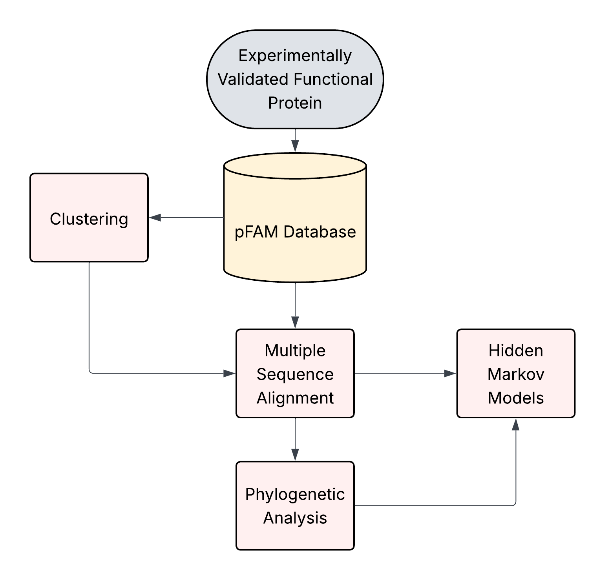
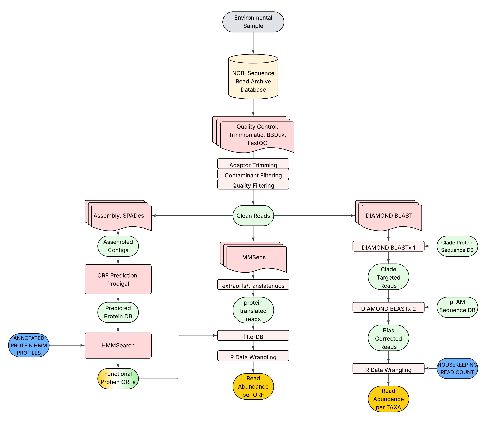
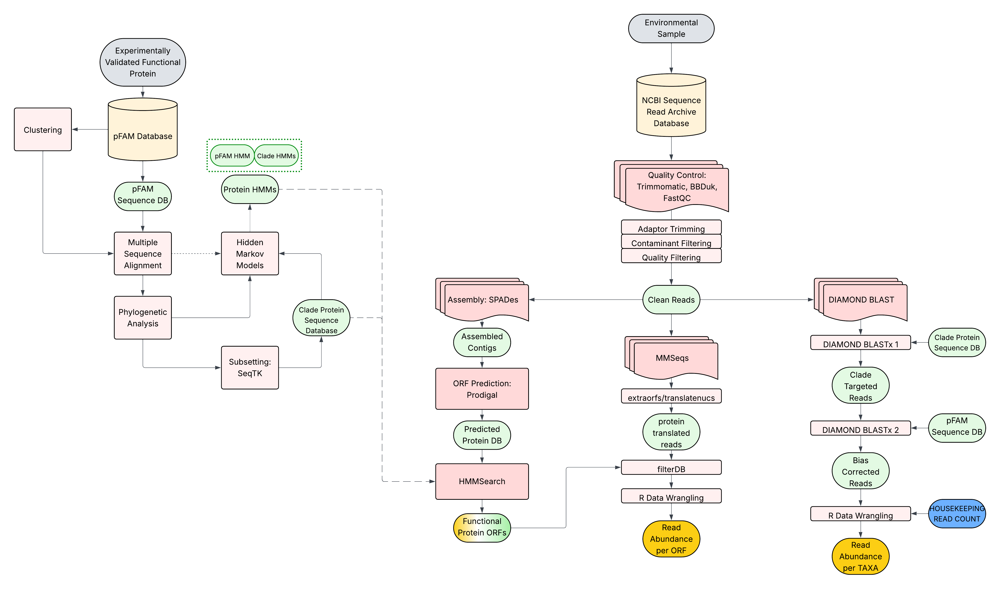

# Summary of GLGY 699
In this course, we have learned functional protein databases, clustering, multiple sequence alignment, hidden markov models, and phylogenetic analysis and tree building. 

We also tackled how metagenome sequencing and analysis is done. You have seen how most metagenome analysis workflow works. Here is an example of a direct analysis of protein abundance in a metagenome:

You must have a question on how can we use all these technique to verify a functional protein from a metagenome?

 

# The rest of GLGY 699
For the rest of the semester, we would like you to process and analyze an actual metagenome. Here is a workflow that you can follow:

More details can be found in [Lesson5-2](./Lesson5-2.md).
