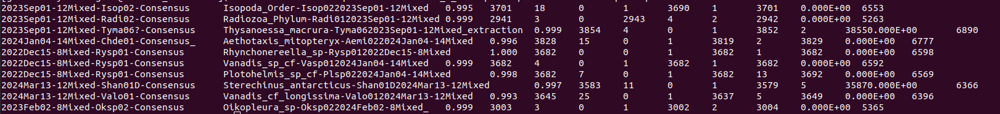
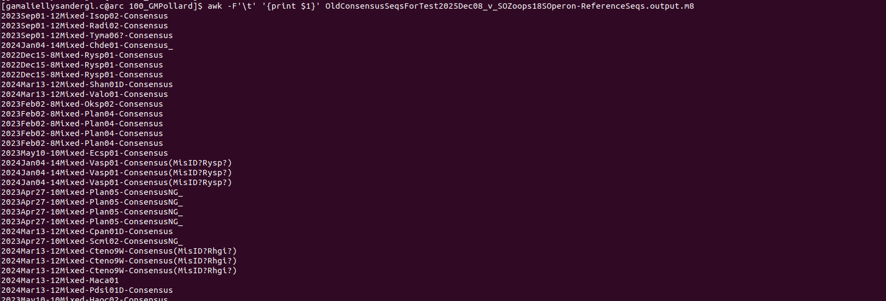

# Exercise 5B
This is an extension of the previous sections to aid in finding annotated proteins in your metagenomic reads.

<br>

## Goals
In this section, we have several goals:
1. We will learn how to subset a fastq/fasta file using the queryID that were mapped by `mmseqs`

This section requires several programs:
1. [SeqTK](https://github.com/lh3/seqtk?tab=readme-ov-file#seqtk-examples)
2. [awk](https://quickref.me/awk.html)


# Creating the list of subset sequences
In the previous section, in several steps, we asked you to subset your fastq reads from the result of either `hmmsearch`, `diamondblast` or `mmseqs`. These programs often outputs an alignment file in which it shows the IDs of queries (i.e. `queryDB` in `mmseqs`) that matches against the mapped database (i.e. `targetDB` in `mmseqs`). An example of the alignment file you'll see is like the one below:



The typical default layout of the `mmseqs2` alignment is as follows. 

| **Column #** | **Column name** | **Description**                                                               |
| ------------ | --------------- | ----------------------------------------------------------------------------- |
| 1            | **query**       | Query sequence ID                                                             |
| 2            | **target**      | Target (database) sequence ID                                                 |
| 3            | **pident**      | Percent of identical matches in the alignment                                 |
| 4            | **alnlen**      | Alignment length (number of aligned positions, including mismatches and gaps) |
| 5            | **mismatch**    | Number of mismatched positions                                                |
| 6            | **gapopen**     | Number of gap openings                                                        |
| 7            | **qstart**      | Start position of the alignment in the query                                  |
| 8            | **qend**        | End position of the alignment in the query                                    |
| 9            | **tstart**      | Start position of the alignment in the target                                 |
| 10           | **tend**        | End position of the alignment in the target                                   |
| 11           | **evalue**      | Expect value (statistical significance of the hit)                            |
| 12           | **bitscore**    | Bit score of the alignment (higher = better)                                  |

The **Column Names** are not often saved in the alignment output file, by default.

{: .note }
>It should be noted, that order of the columns can change depending on the output format you chose or the program you use.

## Getting the list of matched Queries
The header names of your fasta or fastq file should be under the column of `query`. These are all the reads that matches the database (i.e. protein clades in the previous section). To subset them, we need the header names as list of names in `txt` file. Multiple ways it can be done:
1. Open the alignment file (i.e. *m8) in `Excel` > Move the `query` column to a new sheet > Save it as a (`*.txt`) text or tab delimited (`*.tsv`).
    - Processing this in windows program like `Excel`can generate hidden symbols (i.e. \n\r for newline) that might not work with Unix based system
2. Another is opening the file in R and selecting the query column only as new dataframe and saving that data frame to new file.
3. The easiest and fastest Linux or Unix solution is the use of `awk` commands.

## **AWK** 
**AWK** is a scripting language for processing text and used for data analysis and processing. It is a built-in language in most Unix/Linux systems. For more specific samples on how **awk** works, I would suggest checking out [GeeksforGeeks](https://www.geeksforgeeks.org/linux-unix/awk-command-unixlinux-examples/) website.

For our purpose, we will just use awk to subset our `query` column. To do this, just run the following command:

```
awk -F'\t' '{print $1}'
```

The command above means:
- `-F`: to set the delimiter to divide the text into different columns. Here we used tabs `\t`.
- `{print $1}`: to set the output as the first column

It should yield an output like this:



To save it to a file, just use the redirector symbol `>` to a file name you desire (i.e. `matched_queryIDs.txt`).

# Subsetting using SeqTK
To subset the sequences you want (i.e. `matched_queryIDs.txt`), use the command:

> `seqtk subseq oringal_reads.fastq matched_queryIDs.txt > subset_reads.fastq`

In here:
- `seqtk subseq`: the subcommand of seqtk that is used to **extract specific sequences from a FASTA/FASTQ file** based on the list of sequence IDs (or regions).
- `original_reads.fastq`: FASTA or FASTQ file from which to extract the IDs
- `matched_queryIDs.txt`: list of sequence names or IDs (one per line)
- `subset_reads.fastq`: extracted sequences from the original reads

For the purpose of the previous sections, the `subset_reads.fastq` are reads that matched to you clade of interest. These reads will be used for **bias correction** through mapping the subset reads against the wider protein tree (all your clades) to see which one truly matched best in your clade of interest.

# Tips for subsetting:
- Match is on **ID before first whitespace** in FASTA headers
- IDs are **case-sensitive** (normalize with sed 's/>//; s/ .*//')
- Use `sort -u` on ID lists to avoid duplicate output
- Subset **FASTQ keeps qualities** intact
- **Index large FASTA** first (`samtools faidx`) for speed
- If Best-hit only: sort by **bitscore**, then de-duplicate per query
- `seqkit subseq` has **no regex support** → use `seqkit grep` for pattern matching
- Pipe-friendly: works well in one-liners
- **Avoid partial ID matches—must be exact**