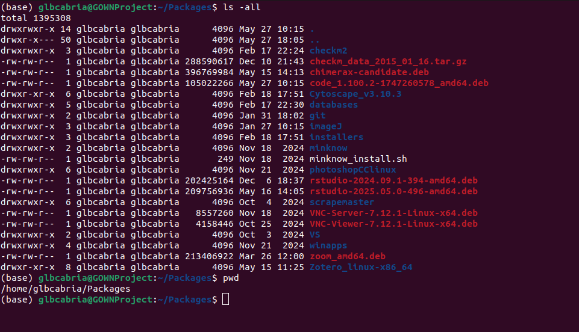

# Lesson 1: The Terminal, the OS, and Bioinfo
## "Unix Enviroment" and Bash Guide

Unix is an OS that originated from the 1960s and directly or indirectly the ancestors of most OS you can see today (Ubuntu, macOS, Android). However, whenever we say "unix or unix-like environment", it often pertains to the command-line interface that are associated with programming and computer science. Before we start the tutorial, let us brief on the terminologies you'll often hear.


    
|**Terminologies**|**Definitions**|
|---|---|
|OS or Operating Systems| are the main program that manages all other application programs and allows the interaction between the user and the computing hardware (e.g. Windows 11, macOS, Ubuntu)|
|Kernel|are core programs in an operating system that manage and bridge processes/programs and the hardware (e.g. Linux, Windows NT, etc.)|
|Shell|is the interface that you interact with the computer. This is primarily divided as **GUI** or *graphical user interface* and the **CLI** *command-line interface*|
|GUI|is the interface in which you utilise visual to interact with the computer|
|CLI|is the primary interface in which you interact with the computer through inputting lines of text or *command-lines*. CLI is often run in ***terminals*** such as *command prompt* in Windows|
|BASH|is a common programming language used in a unix-like environment. Primarily run through CLI|
|HPC or high performance computing| the ability to run programs with large number of cores or memory (RAMs). Primarily done in supercomputers or computer clusters|

## Bioinformatics and the Unix' CLI

Command line interface is primary mode of interaction when running in high performance computing clusters. The additional computing requirement often associated with graphical interface results in most bioinformatics programs and pipeline to be run through command-line interface. In addition to draining computing resources, running GUI-based programs often can be time consuming as you might need to manually click and analyse individual data. Meanwhile, through programming language such as BASH and other softwares in the command-line, you can parallelize your analysis.

In this tutorial, we will dive into the anatomy of a ***command-line interface command/program*** and learn the basic commands in the terminal and BASH to run your bioinformatic analyses.


<center><b><em>A Basic Terminal</em></b></center>

Working with **Terminals** is oftern associated with old OSes or Linux. Windows OS also has a command-line interface, commonly known as **Command Prompt** or `cmd`. Additionally, you can have linux experience also within windows using the **Windows Subsystem in Linux** or **WSL2**. 

To install WSL2: Windows [Guide to WSL2](https://learn.microsoft.com/en-us/windows/wsl/install)
<br>

## Accessing command-line

For your personal computers, you can access command-line interface through **command prompt** in Windows OS or the **terminal** app in MacOS and Linux OSes.

* To open **command prompt** on Windows:
    >1. Search for *Run* in your search bar
    >2. Type *cmd* and run it

* To open **command prompt** on MacOS:
    >1. In Finder, go to *Applications* > *Utilities*
    >2. Double-click *Terminal*

* For Ubuntu and Debian based Linux OS:
    >1. Press your *Home* or *Windows* button
    >2. And search *Terminal*

Other than your local desktop, there are ways to access the servers through command-line interface such as the University of Calgary's [ARC OnDemand](https://ood-arc.rcs.ucalgary.ca/pun/sys/dashboard/) service. 


# <ins>Exercise 1: Accessing Terminal</ins>
For this exercise we will be utilising a web-based terminal through the Binder and JupyterLab interface. 

{: .info }
>JupyterLab is an organizing program to run different programming language in uniform and replicable manner. It is a great tool for bioinformatics and data analysis. This guide is made through JupyterLabs and we will talk more about it in the future. Meanwhile, Binder is an online repository for Jupyter notebooks that allow reproducibility with colleages and anyone you want online.

To open a terminal in Binder, we will use the JupyterLab made for Happy Bell Bioinformatics <cite>(Lee, 2019)</cite>:
1. Open a Firefox (Preferrably)
2. Click this ***[link](https://mybinder.org/v2/gh/AstrobioMike/binder-unix-intro/master?urlpath=lab)*** to open the Binder link
3. Let the repository load and you should be able to see an image like this:

4. Open the *Terminal* as shown.


{: .note }
> 📝 **Note:** Another option to practice is using the online terminal/linux simulation website [**Webminal**](https://webminal.org/)
>> <em><b>It requires registration but allows persistent memory in which you can save files generated.</b></em>

<br>

# Working with Terminals
## Structure of a terminal command

{: .activity }
>***<ins>Try running this command:</ins>***
>
>``` [/home/jovyan/unix_intro]$ ls /home/jovyan/ --all ```

The basic structure of command line interface often shows the current working directory ```[/home/joyvan/unix_intro]``` and followed by the ```$```. Everything on the right of the ```$``` are ***user inputed commands***. Its structure often follow this structure:
* 1st: ```<command> [arguments] [options]```
<br>-or-<br>
* 2nd: ```<program> <command> [arguments] [options]```
<br>-or-<br>
* 3rd: ```<program> [arguments] [options]```


<center><em><b>What do these terms mean:</b></em></center> 
    
|**Terminologies**|**Definitions**|
|---|---|
|Program|The software to run your analysis.|
|Command|The operation within the software that needs ***to be performed*** to run your analysis|
|Arguments|Arguments are required field that indicate the ***user input***|
|Options|Parameters that the user adds to pass on to the command to specify the detail of the run. Can be *optional* or *mandatory*. |
||Options are often key-value pairs with the keys indicates as ```--keys``` and the ```values``` are the one indicated after a space or ```=```|
|Flags|Options that do not have key-value pair (e.g. --all above)|


In the above example, it followed the first structure. The `ls` is a command with the argument ```[FILE] ``` showing the location or path of the file/folder of interest and is shown here as ```/home/jovyan/```. The option here is ```--all``` which reveals all file and folder hidden. 

{: .activity }
>Running the above code should display all files within the ```FILE``` path indicated:
>```
>$ ls /home/jovyan/ --all
total 64
drwxr-xr-x 1 jovyan jovyan 4096 Sep 17 17:28 .
drwxr-xr-x 1 root   root   4096 Dec  7  2022 ..
-rw-r--r-- 1 jovyan jovyan   71 Dec  7  2022 apt.txt
-rw-r--r-- 1 jovyan jovyan  220 Apr  4  2018 .bash_logout
-rw-r--r-- 1 jovyan jovyan 4018 Dec  7  2022 .bashrc
drwxr-xr-x 3 jovyan jovyan 4096 Sep 17 17:28 .cache
drwxr-xr-x 8 jovyan jovyan 4096 Dec  7  2022 .git
drwxr-xr-x 2 jovyan jovyan 4096 Sep 17 17:28 .ipython
drwxr-xr-x 3 jovyan jovyan 4096 Sep 17 17:28 .jupyter
-rw-r--r-- 1 jovyan jovyan 4908 Sep 17 17:29 .jupyter-server-log.txt
drwxr-xr-x 3 jovyan jovyan 4096 Sep 17 17:28 .local
-rw-r--r-- 1 jovyan jovyan  807 Apr  4  2018 .profile
-rw-r--r-- 1 jovyan jovyan  395 Dec  7  2022 README.md
drwxr-xr-x 5 jovyan jovyan 4096 Dec  7  2022 unix_intro
>```

To learn more about the options of a program you can run ```man <program>``` to show its manual or ```<program/command> --help``` or ```<program/command> -h``` to show its help page.
 
{: .activity }
> <ins>**Try Running this code**:</ins> 
>
>```ls --help``` to see the other arguments of the program.
> 
> {: .note }
> Not all programs or commands have a manual or help page.

<br>

## Running Commands

{: .activity }
>***<ins>Try running this command:</ins>***
>```head -n 5 example.txt```

The command structure often has flexibility (**not always**) and you can run the options before the arguments or vice versa as shown above. The options ```-n 5``` was run here in front of the arguments ```example.txt```. The argument states the ```[File]``` that needs to be open. The abovesaid command works differently when you run it without the option ```-n 5```. 

{: .activity }
><ins>**Try Running this code**:</ins> ```head example.txt```

Without the ```-n 5```  option, the ```head``` command displays the first 10 lines of the text by default. Giving the ```-n 5``` option forcefully change the output to the first five lines. Changing the option yields different number of lines you will display.

Other command that display text files are ```tail```, ```more```, ```less```, and others. The command ```tail``` is the opposite of ```head``` and displays the lines from the bottom of the text. The ```more``` command displays all the lines in the text file after the comman-line while ```less``` displays the text files on a separate screen. 

{: .activity }
>***<ins>Try running these commmands</ins>***
>
>```tail```, ```more```, ```less```

<br>

## Filepaths 
When running the commands before, we only specify ```example.txt```. This is because the ```example.txt``` is already located in our **current working directory(CWD)**. To check our **CWD**, we can just look to the left of ```$``` or subsequently `pwd`.

{: .activity }
><ins>***try running the command***</ins>: 
>
>`pwd`

The ```pwd``` command should display your current location: ```/home/jovyan/unix_intro```. The filepath describes the address or location from the ***root```/```*** and all the folders below it: ```jovyan``` and ```unix_intro```. The subsequent forward slash```/``` after home are separator to determine the hierarchy of folders within the path. 

The hierarchy can be visualised as this:
```
/   <-root directory
|
|___bin/
|___dev/
|___home/
    |___jovyan/           <"~" or the username's 'home' folder
        |___unix_intro    <-current working directory
            |___data/
            |___example.txt
            |___experiment/
            |___six_commands/
```
The root `/` contains the folder `bin`, `dev` and `home` among others while `home` contains the folder `jovyan` which has the files.
<br>
<br>

To display again all the files and folder within that location, you can run ```ls```. There should appear the file ```example.txt``` along with all other file.

{:.notice}
> `ls` lists file names only.  
> `ls -l` displays detailed info:  
>> - Permissions (e.g., `drwx`)  
>> - Owner and group (e.g., *jovyan*)  
>> - File size in bytes (e.g., *4096*, *1592*)  
>> - Files and folders (folders appear in **blue**, files in white/black)
>
>{: .warning }
>> Not all terminals has color distinction between files and folders. Better to check 'filesize' as all folders has attribute of *4096*

There are two types of filepath: **absolute path** and **relative path**. The absolute path is the location of the file from the ***root*** of the drive (e.g. `/home/jovyan/unix_intro/example.txt`) while relative path is the location of the file depending on your CWD (e.g. `example.txt` or `./example.txt`). 

{:.note}
> `./` refers to the current directory.  
> `./example.txt` points to a file in the current directory (e.g., `/home/jovyan/unix_intro/`).  
> `../` refers to the parent directory (e.g., `/home/jovyan/`).

Therefore, we can have the same result while running the `head` command with the following examples:

{: .activity }
>`head example.txt`
>
>`head ./example.txt`
>
>`head /home/jovyan/unix_intro/example.txt`

Programs and commands can often interchangeably use absolute or relative path but several scripts/programs are created to follow only absolute or relative path. Please check the programs documentation thoroughly to prevent unwanted problems.
<br><br>

---
### Moving paths
Unlike in GUI which you can use double-click or back button to move between folders and up and down a path, CLI needs to run a command when changing filepath or location. The primary command use to move paths is the ```cd``` or *Change Directory* command. The `cd` command is often follow by either absolute or relative path to change locations.

{: .activity }
>***<ins>Try running this command:</ins>***
>
>```cd ../../```

This command should have move you two folders up your previous location. When you run `pwd`, you will see that you are in the `/home` folder. Now try to return to the previous working directory by running an absolute path as argument: `cd /home/jovyan/unix_intro`.

Additionally, from this CWD, if we want to go into the subfolders/subdirectories such as `experiment/`, we can just run `cd experiment`. Subsequently, we can return to our previous workind directory by running `cd -`.
<br><br>

---
### Moving and copying files and folders
We also move files and folders using commands in CLI. To move files and folders we used the command `mv`. The format of this command is `mv <original filepath> <destination filepath>`. The filepaths can be absolute or relative. 

Let us try moving `example.txt` to inside of `data/` folder:

{: .activity }
>***<ins>Try running this command:</ins>***
>
>```mv ./example.txt ./data/```
>
>Run: ```ls ./```
>
>And afterwards: ```ls ./data/```

As you can see, the example.txt did not appear now in `./` but is located in `./data/`. We can use similar command when moving folders.  Now, let us move back the file `example.txt` to its original location using ```mv ./data/example.txt .```.

The `mv` command can be used also to rename files and folder. You can try renaming `example.txt` to any other name. An example: `mv example.txt example_edited.txt2`. Run a `ls` afterward.

{: .warning }
>⚠️ Renaming files to a filename that is already existing in the destination path would lead to overwriting of the file in the destination path with the file from the orginal filepath.* 
>>*This is a irreversible process that would lead to the loss of the destination filepath's original content.*
<br>

Alternatively, you can copy file instead of moving it. When copying files and folder, run the command `cp <original filepath> <destination filepath>`. These command duplicates your file, so if the file has large sizes ~5-100GB, it might take a while to finish.

{: .warning }
>⚠️ *Copying files observed the same pitfalls are the moving command. This command can overwrite the files in the destination path too. Be very careful!!!*
<br>

---
### Making text files

Files can be created through several ways. Programs can create output files based on their output parameters. You can also create your own `text files` by writing in a text editor. Akin to `notepad` in windows, you can write text files using several programs such as `vim` and `nano`. When creating new text files in this programs, just run the commands:

{: .activity }
>```nano <path to folder destination>/<filename>```
>
>```vim <path to folder destination>/<filename>```
>
>>An example:
>>```nano ./data/newtextfile.txtextensioniwant```

The previous example would create the text file ```newtextfile.txtextensioniwant``` inside the folder `data/`. If you notice, the file extension (anything beyond `.`) is not written as the usual `.txt` file extension. In most cases in a terminal, you can even drop the extension and it will still be treated as a text file. Extensions are just helpful guides for user to know what type of file or program run those file. More on this will be discuss in future lessons.

{: .note }
>Windows text editors often have different way of representing `tabs` or `newlines` than in MacOS and Linux OSes and can affect your program or analyses. However, they can still be open and edited in a Linux or MacOS terminal/text editor.
>
>{: .info }
>> **Microsoft Word files** and other word processor are not recognize as text files as they are save in more elaborate file type.

The two text editors are what are often installed by default in different Linux OSes. Focus on learning just one as both can be overwhelming. To learn more on how to use this text editors, click on this links: [nano](https://www.howtogeek.com/42980/the-beginners-guide-to-nano-the-linux-command-line-text-editor/) and [vim](https://www.freecodecamp.org/news/vim-beginners-guide/)

<div class=image>
    
    <center><em>Vim Text Editor</em></center>
    <br><br>
    
    <center><em>nano Text Editor</em></center>    
</div>

Lastly, you can create an empty text file using the command `touch <filename>`.
<br>

---
### Making folders

For folders, creating a new one requires the command `mkdir <filepath>`. You cannot create a new folder that already exists. The command will output a warning prompt. You can create multiple folders in a single command with multiple input arguments. When running the command, separating the folder names with spaces as shown:

{: .activity }
>```mkdir test test1 test2 test3```

<br>

---
### Removing files and folders

To remove files, use the command `rm`. For folders with items in it, the command often will prompt you that it cannot remove a folder as it is a directory. You can run `rm -r` or the recursive option to delete the folder and all subsequent files inside it.

{: .warning }
>⚠️ **Warning**: Running this command will permanently delete your files.
>There is ***no trash bin to recover your files***. So be very paranoid when removing files in important folders.
>
>⚠️ **Warning**: You can delete other people's file in a shared environment even if you did not made it but have a permission to access those files. So be very careful and do not delete other people's files.
>
>⚠️ **Warning**: Again be very attentive in which files you are deleting. It would be better to delete files individually than in a batch, like deleting a whole folder.


<br>

# <ins>Exercise 2: Creating files and folders</ins>

Let us test some skills you should have learn by now. Please do the following instructions:

1. Go to your username's home folder
2. Create a folder named `Exercise2`
3. Go to the folder inside `unix_intro` named `six_commands`
4. Get your current working directory
5. Run `ls -all` and copy its output by highlighting it with your mouse and using the `right-click` button
6. Create a file inside the CWD named `exercise2.txt` using `nano`
7. Paste the text you have copy using `Ctrl+Shift+V` or the mouse
8. On the next seven lines, write the colors of the rainbow in any order
9. Save your file using `^X` or colloquially known as `Ctrl+X` and then `Yes`
10. Copy that file to the previously made `Exercise2` folder.
11. Rename the file using mv to `exercise2.<whateverextension you prefer>`
12. View the file using either `more`, `less`, `head` or `tail` commands

If there are any questions and problems. Do not hesitate to ask.

<br>

# Tips and Summary
Basic Unix-like environment terms


|**Terminologies**|**Definitions**|
|---|---|
|`path`|address of files and folder within the computer|
|CWD/PWD| the current or present working directory is the location of the terminal within the computer hierarchy. This is where you currently are.|
|`root`|is the top-level directory in a computer partition|
||root directory is represented as `C:\` or `D:\` in windows and `\` in Linux or macOS|
| `~` |the user's home folder is where the personal files of the user is located. It is often the first location when booting a terminal.|
||It can be represented as `~/` but is often located in `/home/<username>/`|
|absolute path|the address of file and folder from the specified 'root' or 'home' location|
|relative path|the path of files and folders based on your CWD|
|`./`|In relative path, this indicate the CWD|
|`../`|In relative path, this indicate the folder above the CWD|
|`-`|When running the `cd` command, `-` represents the previous working directory|


Commands in this lecture:


|**Commands**|**Definitions**|
|---|---|
|`ls`|The **list** command shows the files and folder inside the supplied *ARGUMENT* |
|`head`|The **head** command shows the top lines within the  *ARGUMENT* supplied text file|
|`tail`|The opposite of **head**. The tail shows the bottom lines|
|`more`|Displays a text file within the terminal|
|`less`|Displays a text file in the terminal on a separate screen instance|
|`pwd`|a command to show the current or present working directory|
|`cd`|The **change directory** command moves the current working directory|
|`mv`|The **move** command moves files and folders from the `<orginal filepath>` to the `<destination filepath>`|
|`cp`|The **copy** command creates a copy of files from the `<orginal filepath>` to the `<destination filepath>`|
|`mkdir`|creates a new directory|
|`rm`|The **remove** command deletes a file or folder|
||⚠️ **Warning**: There is no trash bin in the terminal or linux. Deleted files are deleted permanently|
|`nano`|A text-editor. Create a file by running `nano <filename>`|
|`vim`|Another text-editor similar to previous one|
|--help|is a *flag* that aids in identifying all the arguments of most of the command displayed above|


# Acknowledgement
This tutorial is adapted from *Intro to Unix* from Happy Belly Bioinformatics by Michael D. Lee or known as [AstroBioMike in github](https://astrobiomike.github.io/unix/).

# Citation
[1] Lee, (2019). Happy Belly Bioinformatics: an open-source resource dedicated to helping biologists utilize bioinformatics. Journal of Open Source Education, 4(41), 53, https://doi.org/10.21105/jose.00053

